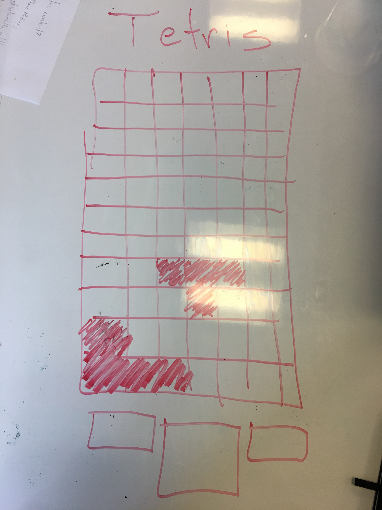
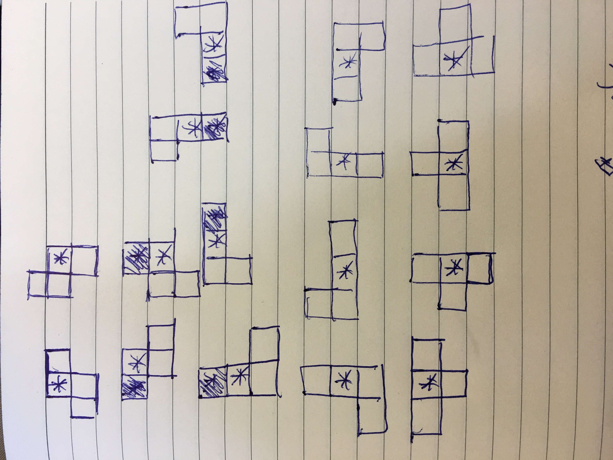

# CODA Unit 1 Game - Tetris

## Overview

Game based on efficiently stacking blocks of different shapes and colors into a 10x20 grid. When a row is completely filled by blocks, the row is destroyed and the blocks above it move down to fill the empty space.

 

## Technologies Used

- HTML
- CSS
- JavaScript
- jQuery

# Process / Approach

- Create a Tetris board
- Create a logical representation of the the different pieces and all possible orientations
- Implement random generation of pieces
- Implement dropping and animation of pieces
- Implement shifting of pieces
- Implement rotation of pieces
- Implement collision detection for dropping, shifting and rotating
- Remove rows once they have been filled
- Track the players score
- Style elements

# Bugs

- Rotation of pieces can sometimes cause clipping with other pieces

# Wins & challenges

- Creating mathematical representations of:
  - each piece for all orientations
  - collisions points for all orientations

- Handling collision logic with:
  - Bottom of board
  - Sides of board
  - Other pieces

- Implementing mobile controls

# Chosen Game

- Tetris

# Rules

- Once the start button is clicked, tetris pieces are randomly generated and dropped from the top of the screen.
- The players goal is to stack blocks efficiently in order to completely fill rows.
- Once a row is filled, the row is destroyed and the pieces above it are shifted down and the player score is increased.
- Players can:
  - Start and reset the game using the buttons under the Tetris board
  - Shift pieces left and right using clicks or button presses
    - Left arrow or clicking on the first 3 columns shifts a piece left
    - Right arrow or clicking on the last 3 columns shifts a piece right
    - The 'r' key or clicking on the middle 4 columns rotates a piece
- Once the pieces stack all the way to the top of the Tetris the player loses

# Web Application Development Process

- Create & clone github repository
- Create files and folders needed for project
- Create boilerplate HTML code
- Create basic css rules
- Implement the creation of elements and game logic using JavaScript
- Regularly commit and push to github
- Once project is complete gh-pages branch is created and website is live
